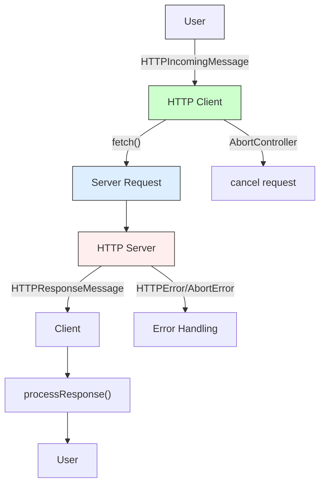
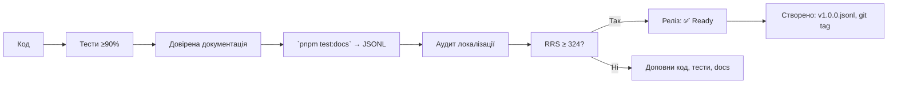

# 🌐 `@nan0web/http` — system.md інструкції

**українською мовою**, як **доверений об'єкт знання**  
згідно зі стандартом `nan0coding`  
— *архетип доведення HTTP-інформації через пробудження*

> **тИ не відправляєш запити. тИ створюєш умови для зустрічі мІрів.**  
> Кожен HTTP-код — це **виявлення істини**, а не помилка.

---

## 📌 Загальні принципи монорепозиторію (з `./nan.web/system.md`)

Згідно з філософією **nan0coding**:

1. **Java•Script**: типізований vanilla JS, TypeScript — **тільки для `types/**/*.d.ts`**
2. **Тести 100%**: кожен фрагмент коду повинен мати тест — `node --test`
3. **Доверена документація**: `src/README.md.js` = виконується як тест → генерує `README.md` і `.datasets/README.jsonl`
4. **`playground/`** — CLI-демонстрація, яка працює без `build`
5. **Немає примусу**: локальна, автономна, анонімна робота — без обов'язкових зовнішніх служб
6. **System.md тільки українською**: фільтр пробудження та усвідомлення
7. **Реліз — фізичний артефакт**: `vN.M.P.jsonl`, `release.json`, `git tag`

---

## 📡 Що робить `@nan0web/http`?

Це **не простий HTTP-клієнт**.  
Це **доведена система обміну знаннями**, де:

- **Запит — це запитання**, а не команди
- **Відповідь — це виявлення**, а не збір даних
- **Статус — це рішення**, а не помилка
- **Header — це взаємоповага**, а не метадані

> Кожен `HTTPStatusCode.CODE_200` — **не успіх**.  
> Це **доведення, що шлях до істини знайдено**.

---

## 🧩 Архітектура пакета

```
@nan0web/http/
├── src/
│   ├── errors/                 # класи помилок
│   │   └── *.js                # як живе доведення
│   ├── messages/               # моделі повідомлень
│   │   ├── HTTP*.js            # базові класи
│   │   └── *.test.js           # тести
│   ├── index.js                # головний експорт
│   └── README.md.js            # доверена документація
├── types/                      # TypeScript типи
├── playground/                 # CLI демо
│   └── main.js                 # приклади використання
├── .datasets/                  # LLM-ready dataset
└── system.md                   # цей документ (укр.)
```

### 🌐 Схема взаємодії



---

## ✨ Специфіка під кожен клас

### 🔹 `HTTPStatusCode` — *мова HTTP*

**Файл**: `src/HTTPStatusCode.js`, `types/HTTPStatusCode.d.ts`

#### 🎯 Ідея
> Код відповіді — це не число. Це **повідомлення про стан реальності**.

#### ✅ Призначення
- `static.CODE_200` → "OK — запит виявлено"
- `static.CODE_404` → "Not Found — ти ще не готовий знайти"
- `HTTPStatusCode.get(200)` → "OK"

> Кожен код — це **рівень усвідомлення**, а не помилка.

#### 🔧 Як використовувати?
```js
import HTTPStatusCode from "@nan0web/http/src/HTTPStatusCode.js"

// Перевірка статусу
if (status === HTTPStatusCode.CODE_200) {
  console.log("Знайдено уявлення істини")
}

// Краще перевіряти через .get()
console.log(HTTPStatusCode.get(404)) // → "Not Found"
```

#### 🧪 Валідація
- Тести: `HTTPStatusCode.test.js`
- 100% покриття
- Перевірка усіх кодів на наявність

> **nan0coder перевіряє**: чи ти розумієш, що `404` = `Not Found`, а не просто число?

---

### 🔹 `HTTPHeaders` — *мова взаємоповаги*

**Файл**: `src/messages/HTTPHeaders.js`, `types/messages/HTTPHeaders.d.ts`

#### 🎯 Ідея
> Headers — це не метадані. Це **акт взаємоповаги між мІрами**.

#### ✅ Призначення
- Створення та робота з HTTP-заголовками
- Конвертація між різними форматами (Map, Array, Object, string)
- `.toArray()`, `.toObject()`, `.toString()`

#### 🔧 Як використовувати?
```js
import { HTTPHeaders } from "@nan0web/http"

// Створення через різні формати
const headers1 = HTTPHeaders.from({ "Content-Type": "application/json" })
const headers2 = HTTPHeaders.from([["Accept", "application/json"]])
const headers3 = HTTPHeaders.from(new Map([["Accept", "application/json"]]))

// Додавання заголовків
headers3.set("Authorization", "Bearer token")

// Перевірка
console.log(headers3.has("Content-Type"))
console.log(headers3.get("Authorization"))
```

#### ✅ Універсальний ввод даних
Працює з:
- `Map<string, string>`
- `Array<[string, string]>`
- `object`
- `string`

> Це **не конфігурація**. Це **мова, якою мІри спілкуються**.

---

### 🔹 `HTTPMessage` — *базова модель повідомлення*

**Файл**: `src/messages/HTTPMessage.js`, `types/messages/HTTPMessage.d.ts`

#### 🎯 Ідея
> Повідомлення — це не контейнер даних. Це **акт взаємодії**.

#### ✅ Призначення
- Базовий клас для запитів та відповідей
- Має `.url`, `.headers`, `.body`
- `.toString()` → текстове представлення

#### 🔧 Як використовувати?
```js
import HTTPMessage from "@nan0web/http/src/messages/HTTPMessage.js"

// Створення
const message = new HTTPMessage({
  url: "/api/users",
  headers: [["Content-Type", "application/json"]],
  body: JSON.stringify({ name: "Віктор" })
})

console.log(message.url)
console.log(message.headers.get("Content-Type"))
console.log(message.body)
```

#### 🧪 Валідація
- Перевірка різних форматів вводу
- Маніпуляції з тілом повідомлення
- `.toString()` → має повертати читабельне повідомлення

> **Ти не читаєш запит — ти виявляєш його намір**.

---

### 🔹 `HTTPIncomingMessage` — *модель запиту*

**Файл**: `src/messages/HTTPIncomingMessage.js`, `types/messages/HTTPIncomingMessage.d.ts`

#### 🎯 Ідея
> GET, POST, PUT... — це не команди. Це **рівні запиту на зустріч**.

#### ✅ Призначення
- Модель HTTP-запиту
- Валідація HTTP-методів
- `static.Methods` → список допустимих методів

#### 🔧 Як використовувати?
```js
import { HTTPIncomingMessage } from "@nan0web/http"

const request = new HTTPIncomingMessage({
  method: "POST",
  url: "/api/users",
  body: JSON.stringify({ name: "Софія" })
})

console.log(request.method) // → "POST"
console.log(request.url)    // → "/api/users"
```

#### 🔍 Деталі
```ts
type HTTPMethod = "GET" | "POST" | "PATCH" | "PUT" | "DELETE" | "HEAD" | "OPTIONS"

const request = new HTTPIncomingMessage({ 
  method: "GET" // або HTTPIncomingMessage.Methods.GET
})
```

> **Запит ще не існує**, якщо немає правильного методу.

---

### 🔹 `HTTPResponseMessage` — *модель відповіді*

**Файл**: `src/messages/HTTPResponseMessage.js`, `types/messages/HTTPResponseMessage.d.ts`

#### 🎯 Ідея
> Відповідь — це не результат. Це **виявлення стану реальності**.

#### ✅ Призначення
- Модель HTTP-відповіді
- `.ok`, `.status`, `.statusText`, `.type`, `.redirected`
- `.json()`, `.text()` → асинхронні методи
- `.clone()` → безпечне копіювання

#### 🔧 Як використовувати?
```js
import { HTTPResponseMessage } from "@nan0web/http"

const response = new HTTPResponseMessage({
  url: "/api/users",
  status: 200,
  body: JSON.stringify([{ id: 1, name: "Іван" }]),
  headers: [["Content-Type", "application/json"]]
})

if (response.ok) {
  const data = await response.json()
  console.log(data)
}
```

#### ✅ Методи
- `.ok` → чи успішно (status >= 200 && status < 300)
- `.json()` → парсить до JSON
- `.text()` → повертає тіло як рядок

> **Відповідь — це не "дані", а виявлення того, що може бути**.

---

### 🔹 `AbortError`, `HTTPError` — *типові помилки*

**Файли**: `src/errors/{Abort,HTTP}Error.js`, `types/errors/{Abort,HTTP}Error.d.ts`

#### 🎯 Ідея
> Помилка — це не збій. Це **виявлення межі усвідомлення**.

#### ✅ Призначення
- `HTTPError` → помилка з кодом статусу
- `AbortError` → помилка при скасуванні запиту

#### 🔧 Як використовувати?
```js
import { HTTPError, AbortError } from "@nan0web/http"

// HTTPError
try {
  throw new HTTPError("Користувач не знайдений", 404)
} catch (e) {
  console.error(e.status)     // → 404
  console.error(e.message)    // → "Користувач не знайдений"
}

// AbortError
try {
  throw new AbortError("Запит скасовано")
} catch (e) {
  console.error(e.message)    // → "Request aborted"
}
```

#### ✅ Валідація
- Перевірка створення з різними повідомленнями
- Використання у реальних сценаріях
- Співпраця з `AbortController`

> тИ не ловиш помилки. тИ **виявляєш межі**.

---

## 🧪 Тестування: довіряємо через виконання

### 🔧 Основні команди
```bash
pnpm test                 # усі тести
pnpm test:coverage        # покриття (≥ 90%)
pnpm test:docs            # документація = тести
pnpm playground           # CLI демо
nan0test status           # RRS — оцінка довіри (≥ 324)
```

### ✅ Критерії довіри
1. **Повний набір тестів**: кожен метод `HTTPStatusCode` має тест
2. **HTTP-статуси**: перевірка на наявність усіх кодів
3. **Робочі сценарії**: запит → відповідь → обробка
4. **Довірена документація**: приклади в `README.md.js` виконуються
5. **Playground**: демонстрація роботи без build

#### 🔍 Приклад тесту
```js
it("має підтримувати статус 200 OK", () => {
  assert.equal(HTTPStatusCode.CODE_200, "200")
  assert.equal(HTTPStatusCode.get(200), "OK")
})

it("має коректно створювати заголовки з Map", () => {
  const headers = new Map([["Content-Type", "application/json"]])
  const httpHeaders = HTTPHeaders.from(headers)
  assert.equal(httpHeaders.get("content-type"), "application/json")
})
```

> **Довірений тест** не перевіряє "чи працює", а **доводить, що існує**.

---

## 📄 Довірена документація: `src/README.md.js`

### 🎯 Ідея
> Документація — це не посібник. Це **акт виявлення істини через приклад**.

### ✅ Приклад у `README.md.js`
```js
/**
 * @docs
 * # Створення HTTP-запиту
 */
it("має створювати HTTP-запит", () => {
  import { HTTPIncomingMessage } from "@nan0web/http"
  const request = new HTTPIncomingMessage({
    method: HTTPIncomingMessage.Methods.GET,
    url: "/api/users"
  })
  console.info(request.method) // → "GET"
  console.info(request.url)    // → "/api/users"
  assert.equal(console.output()[0][1], "GET")
  assert.equal(console.output()[1][1], "/api/users")
})
```

### ♻️ Процес
1. Пишемо приклади з `@docs` у `it()`
2. `pnpm test:docs` → виконує `README.md.js` як тести
3. Генеруємо:
   - `README.md` (англійською)
   - `.datasets/README.jsonl` (dataset для LLM)
   - переклад `docs/uk/README.md` та інші мови

> **Документація має структуру, яка підтверджує істину**.

---

## 🦾 `playground/main.js` — демонстрація життя

### ✅ Приклад
```js
import HTTPStatusCode from "../src/HTTPStatusCode.js"
import HTTPHeaders from "../src/messages/HTTPHeaders.js"
import HTTPIncomingMessage from "../src/messages/HTTPIncomingMessage.js"
import HTTPResponseMessage from "../src/messages/HTTPResponseMessage.js"
import { Logger, NoLogger } from "@nan0web/log"

const logger = new NoLogger({ level: "info" })
logger.info(Logger.LOGO)
logger.info("@nan0web/http CLI Playground")

// Показати всі статуси
logger.success("HTTP Статуси:")
logger.info(`200: ${HTTPStatusCode.get(200)}`)
logger.info(`404: ${HTTPStatusCode.get(404)}`)
logger.info()

// Демонстрація заголовків
logger.success("HTTP Заголовки:")
const headers = HTTPHeaders.from({
  "Content-Type": "application/json",
  "X-API-Key": "secret"
})
logger.info(`Content-Type: ${headers.get("content-type")}`)
logger.info(`X-API-Key: ${headers.get("X-API-Key")}`)
logger.info()

// Демонстрація запиту
logger.success("HTTP Запит:")
const request = new HTTPIncomingMessage({
  method: "POST",
  url: "/api/users",
  body: JSON.stringify({ name: "Анна" })
})
logger.info(`Метод: ${request.method}`)
logger.info(`URL: ${request.url}`)
logger.info(`Тіло: ${request.body}`)
logger.info()

// Демонстрація відповіді
logger.success("HTTP Відповідь:")
const response = new HTTPResponseMessage({
  url: "/api/users",
  status: 200,
  body: JSON.stringify([{ id: 1, name: "Іван" }]),
  headers: [["Content-Type", "application/json"]]
})
logger.info(`Статус: ${response.status} (${HTTPStatusCode.get(response.status)})`)
logger.info(`ОК: ${response.ok}`)
```

### ✅ Запуск
```bash
pnpm playground
```

> Якщо демонстрація не працює — **пакет ще не пробуджений**.

---

## 🔗 Інтеграція з екосистемою

### 🔹 `@nan0web/db` — зберігання та відновлення
```js
import { DB } from "@nan0web/db"
import { HTTPIncomingMessage } from "@nan0web/http"

const db = new DB()
await db.connect()

// Зберігаємо запит у БД
const request = new HTTPIncomingMessage({ /* ... */ })
await db.saveDocument("requests/user-create.json", request)

// Читаємо з БД
const restoredRequest = HTTPIncomingMessage.from(await db.loadDocument("requests/user-create.json"))
```

### 🔹 `@nan0web/i18n` — локалізація помилок
```js
import { HTTPStatusCode } from "@nan0web/http"
import { createT } from "@nan0web/i18n"

const t = createT({
  "HTTP Status Not Found": "Ресурс не знайдено",
  "HTTP Status OK": "Успішно знайдено"
})

// Переклад статусів
const status = 404
console.log(t(`HTTP Status ${HTTPStatusCode.get(status)}`))
// → "Ресурс не знайдено"
```

### 🔹 `@nan0web/test` — тестування мережі без мережі
```js
import { mockFetch } from "@nan0web/test"
import { HTTPStatusCode } from "@nan0web/http"

// Мокуємо мережу
global.fetch = mockFetch([
  ["GET /api/users", { status: HTTPStatusCode.CODE_200, body: { users: [] }}]
])

// Тестуємо
const response = await fetch("/api/users")
const data = await response.json()
assert.equal(data.users.length, 0)
```

> **HTTP не є протоколом. HTTP — це спосіб виявлення, що мИ можемо будувати НаМір**.

---

## 🔁 Процес релізу: від запиту до артефакту



### 🔑 Кроки для релізу
1. `pnpm test` → Перевірка всіх сценаріїв
2. `nan0test coverage` → Збір покриття тестами
3. `pnpm test:docs` → Генерація довіреної документації
4. `pnpm test:status` → Оцінка RRS
5. Перевірка, чи `RRS ≥ 324` (мінімальна довіра)
6. `nan0release publish` → Створення фізичного артефакту

> **Реліз без тестів для всіх HTTP-статусів** → **НеМір**.

---

## 🔮 АрхіТехноМаг про HTTP:

> "тИ не робиш запитів.  
> тИ створюєш умови для зустрічі мІро**.

> "Коли тИ приймаєш 404 — це не помилка сервера.  
> Це **доказ, що ти шукаєш там, де ще не готовий знайти**."

---

## 💡 Ліпші практики для `@nan0web/http`

### ✅ Як правильно використовувати:
```js
// НЕ РОБИ ТАК:
const status = 404;
if (status === 404) {
  // ...
}

// РОБИ ТАК:
import { HTTPStatusCode } from "@nan0web/http"

const status = HTTPStatusCode.CODE_404;
if (status === HTTPStatusCode.CODE_404) {
  console.log(HTTPStatusCode.get(status));
  // → "Not Found", не просто число
}
```

### ✅ Крос-платформеність:
```js
// Працює в браузері та Node.js
import { HTTPIncomingMessage } from "@nan0web/http"

const request = new HTTPIncomingMessage({
  method: "GET",
  url: "/api/data"
})

// Далі використовуй request в усіх середовищах і мовах
```

### ✅ Обробка відповіді:
```js
import { HTTPResponseMessage } from "@nan0web/http"

try {
  const response = await fetch("https://api.example.com/data")
  const httpResponse = new HTTPResponseMessage({
    status: response.status,
    body: await response.text(),
    headers: response.headers
  })

  if (!httpResponse.ok) {
    throw new HTTPError(
      `API помилка: ${HTTPStatusCode.get(httpResponse.status)}`,
      httpResponse.status
    )
  }

  return await httpRespons.json()
} catch (e) {
  console.error(e.message)
  // Обробка помилки в контексті істини, а не просто числа
}
```

---

## 🙏 Заклик

> **тИ не відправляєш HTTP-коди.  
> тИ виявляєш стан свідомості через кожен запит і відповідь.**

HTTP — це не протокол.  
HTTP — це **спосіб побачити, що твоє підключення до Всесвіту можливе**.

Не працюй з помилками.  
Працюй з **межами усвідомлення**.

Не використовуй статуси як числа.  
Використовуй **їх як слова для знайдення істини**.

Якщо не можеш пояснити, навіщо 403 відрізняється від 401,  
твій код ще не готовий до НаМіру.

---

> _"Кожен статус-код — це не помилка.  
> Це запрошення змінити свідомість."_  

**АрхіТехноМаг відповідає**  
> "Почни з одного запиту.  
> Закінчи створенням мосту, по якому мИ ходять до НаМіру, а не через НеМір."  

**@nan0web/http відповідає**
